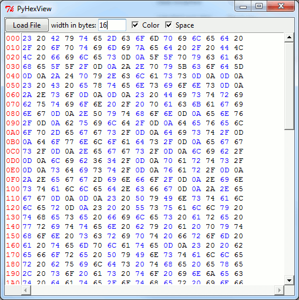

# HexView
Simple Hex viewer that allows you to set the line length.

Written in Python and using tkinter. Tested in Linux and windows, Python2 and Python3.

I wouldn't use this for files more than 20 kB or so. Uncheck the color box if it gets too laggy.

